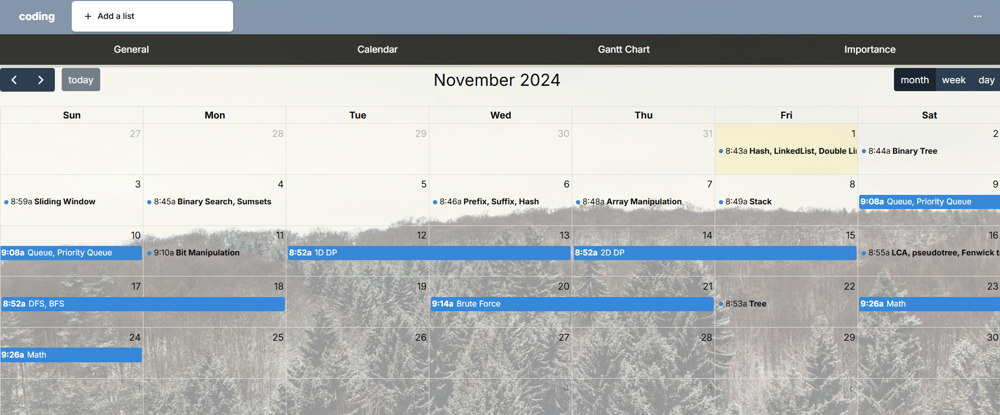
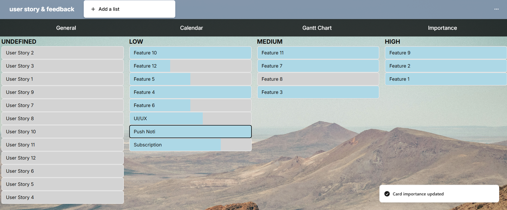

## Project Overview

This project is designed to efficiently manage tasks and projects. Below are some screenshots showcasing the key features of the application:

### Workspace

The workspace provides an overview of all projects across different organizations. Users can sign in using Google and be assigned roles as admins or workers. All actions are logged under activity. Users can build their own dashboards or use predesigned models to track their projects. Each dashboard offers access to a general dashboard view, calendar view, Gantt chart, and importance view.

### Calendar View

The calendar view helps track deadlines on daily, weekly, and monthly views.

### Gantt Chart

The Gantt chart tracks project progress and the relationships between tasks.

### Importance View

The importance view allows users to prioritize and update the importance of tasks. Projects can be added personally or assigned by an admin.

### User Story

The user story view manages key feature manipulation, tracking, and user feedback.

This is a [Next.js](https://nextjs.org/) project bootstrapped with [`create-next-app`](https://github.com/vercel/next.js/tree/canary/packages/create-next-app).

## Getting Started

First, run the development server:

```bash
npm run dev
# or
yarn dev
# or
pnpm dev
# or
bun dev
Open [http://localhost:3000](http://localhost:3000) with your browser to see the result.

You can start editing the page by modifying `app/page.tsx`. The page auto-updates as you edit the file.

This project uses [`next/font`](https://nextjs.org/docs/basic-features/font-optimization) to automatically optimize and load Inter, a custom Google Font.

## Learn More

To learn more about Next.js, take a look at the following resources:

- [Next.js Documentation](https://nextjs.org/docs) - learn about Next.js features and API.
- [Learn Next.js](https://nextjs.org/learn) - an interactive Next.js tutorial.

You can check out [the Next.js GitHub repository](https://github.com/vercel/next.js/) - your feedback and contributions are welcome!

## Deploy on Vercel

The easiest way to deploy your Next.js app is to use the [Vercel Platform](https://vercel.com/new?utm_medium=default-template&filter=next.js&utm_source=create-next-app&utm_campaign=create-next-app-readme) from the creators of Next.js.

Check out our [Next.js deployment documentation](https://nextjs.org/docs/deployment) for more details.
